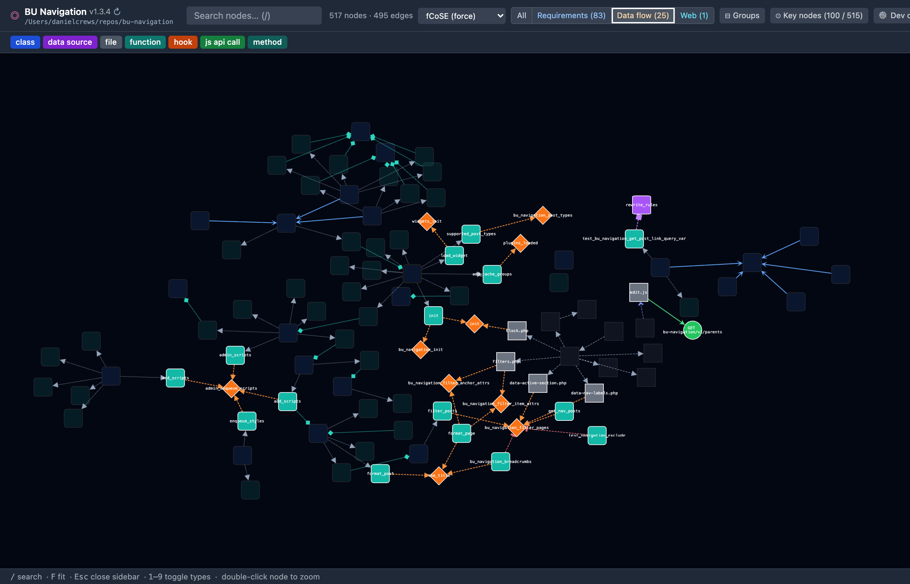
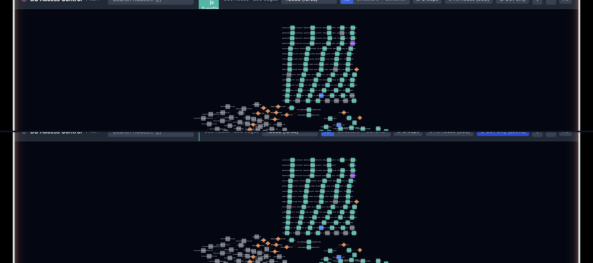

# Plugin Profiler

> **Visualize the architecture of any WordPress plugin, theme, or PHP application as an interactive graph.**

Plugin Profiler is a Dockerized static analysis tool that scans a PHP codebase, parses all PHP, JavaScript, and `block.json` files, and produces an interactive [Cytoscape.js](https://js.cytoscape.org) graph of its architecture — classes, hooks, data sources, REST endpoints, Gutenberg blocks, security annotations, circular dependencies, and more. Optionally, an LLM generates a plain-English description for every entity.

---

## Screenshots

> _Analyzing Plugin Profiler's own codebase (653 nodes, 601 edges). Run takes ~4 seconds without AI descriptions._

| Graph overview — fCoSE force-directed layout | Node detail — sidebar inspector |
|---|---|
| [](docs/images/overview.png) | [](docs/images/node-detail.png) |

| Data flow view — hooks and data edges | Requirements view — structural edges |
|---|---|
| [](docs/images/node-detail-graph.png) | [](docs/images/dev-only.png) |

The **Key nodes** view (default) shows the most-connected entities plus one hop of context. Click **All nodes** in the toolbar to reveal the full graph.

---

## What it detects

| Language / File | What's extracted |
|---|---|
| **PHP** | Classes, interfaces, traits, methods, standalone functions |
| **PHP** | `add_action` / `add_filter` hook registrations, `do_action` / `apply_filters` triggers |
| **PHP** | Options API, post meta, user meta, transients, `$wpdb`, PDO, MySQLi queries |
| **PHP** | REST routes (with `permission_callback` extraction), AJAX handlers, shortcodes, admin pages, cron jobs, post types, taxonomies, HTTP calls |
| **PHP** | `include` / `require` file relationships, class instantiation (`new`), trait usage |
| **PHP** | Security patterns: `current_user_can()`, `wp_verify_nonce()`, sanitization functions |
| **JavaScript / JSX / TS / TSX** | `registerBlockType`, `addAction`, `addFilter`, `apiFetch`, React components, `@wordpress/data` stores |
| **block.json** | Gutenberg block definitions, render templates, enqueued scripts |
| **Cross-language** | JS `apiFetch` calls matched to PHP REST endpoints, AJAX fetches matched to PHP handlers, Gutenberg block JS ↔ PHP definitions |

### Post-parse enrichment

After parsing, several analysis passes run automatically:

- **Cross-reference resolution** — Connects JS `apiFetch()` calls to their PHP REST endpoints, AJAX fetches to PHP handlers, and Gutenberg block JS registrations to PHP block definitions
- **Security annotation** — Scans function/method bodies for `current_user_can()`, `wp_verify_nonce()`, `check_ajax_referer()`, and sanitization calls; propagates findings to connected endpoints
- **Circular dependency detection** — DFS-based cycle detection on structural edges (inheritance, calls, includes, instantiation); reports all unique cycles in the graph
- **Metadata description synthesis** — Generates human-readable descriptions from node metadata (namespace, params, return type, hook priority, route pattern, etc.) so every node has context even without AI

---

## Requirements

| Requirement | Notes |
|---|---|
| [Docker Desktop](https://www.docker.com/products/docker-desktop/) ≥ 4.x | Or Docker Engine + Compose v2 on Linux |
| Docker Compose v2 | `docker compose version` must work (note: no hyphen) |

No PHP, Node.js, or Composer installation needed on the host machine.

---

## Quick start

```bash
# Clone the repo
git clone https://github.com/bu-ist/plugin-profiler.git
cd plugin-profiler

# Make the CLI script executable (once)
chmod +x bin/plugin-profiler

# Analyze a plugin (fast, no AI)
./bin/plugin-profiler analyze /path/to/your-wp-plugin
```

The command will:
1. Build the Docker images (first run only — ~2 min)
2. Scan and parse the plugin
3. Write `graph-data.json` to a shared Docker volume
4. Start a local web server on port 9000
5. Open `http://localhost:9000` in your default browser

---

## Installation

### Option A — `bin/plugin-profiler` wrapper (recommended)

The `bin/plugin-profiler` shell script is the primary interface. Symlink it onto your `PATH` for convenience:

```bash
sudo ln -s "$(pwd)/bin/plugin-profiler" /usr/local/bin/plugin-profiler
```

Then from any directory:

```bash
plugin-profiler analyze ~/Sites/woocommerce
```

### Option B — Docker Compose directly

```bash
PLUGIN_PATH=/absolute/path/to/plugin \
  docker compose run --rm analyzer /plugin

PLUGIN_PATH=/absolute/path/to/plugin \
  docker compose up -d web
```

Then visit `http://localhost:9000`.

---

## CLI reference

```
Usage: plugin-profiler analyze <plugin-path> [options]

Arguments:
  <plugin-path>        Absolute or relative path to the plugin / theme / PHP app directory

Options:
  --port <n>           Port for the web UI  (default: 9000)
  --llm <provider>     LLM provider: claude, ollama, openai, gemini  (default: ollama)
  --model <name>       LLM model identifier  (default: qwen2.5-coder:7b)
  --api-key <key>      API key for external LLM providers
  --descriptions       Enable AI description generation via LLM
  --json-only          Write graph-data.json only; do not start the web server
  --output <dir>       Output directory inside the container  (default: /output)
  --help               Show help
```

### Examples

```bash
# Basic analysis (default, no AI descriptions)
plugin-profiler analyze ./my-plugin

# Use Google Gemini for descriptions
plugin-profiler analyze ./my-plugin \
  --llm gemini \
  --model gemini-2.5-flash \
  --api-key YOUR_GEMINI_KEY

# Use OpenAI GPT-4o mini
plugin-profiler analyze ./my-plugin \
  --llm openai \
  --model gpt-4o-mini \
  --api-key sk-...

# Use Claude (Anthropic)
plugin-profiler analyze ./my-plugin \
  --llm claude \
  --model claude-haiku-4-5-20251001 \
  --api-key sk-ant-...

# Use local Ollama (starts Ollama container automatically)
plugin-profiler analyze ./my-plugin \
  --llm ollama \
  --model qwen2.5-coder:7b

# Analyze a WordPress theme
plugin-profiler analyze ~/Sites/flavor-developer

# Output JSON only, then serve manually
plugin-profiler analyze ./my-plugin --json-only
```

---

## LLM description generation

Plugin Profiler can generate a 2–3 sentence description for every developer-authored node in the graph using an LLM. This is optional — pass `--descriptions` to enable it.

Even without an LLM, every node gets a useful description. The tool extracts PHPDoc blocks automatically and synthesizes descriptions from structural metadata (namespace, parameters, return type, hook priority, route pattern, capability requirements, etc.) — so the default no-AI mode still produces an informative graph.

Descriptions are only generated for nodes the developer actually wrote. Bundled libraries (detected from directory names like `lib/`, `third-party/`, `bower_components/`, etc.) are automatically skipped.

### Supported providers

| Provider | `--llm` value | Speed (100 dev nodes) | Cost (100 nodes) |
|---|---|---|---|
| **Ollama (local)** | `ollama` | ~2–5 min | Free |
| **Claude Haiku** | `claude` | ~30–60 sec | ~$0.01 |
| **Claude Sonnet** | `claude` | ~2–3 min | ~$0.30 |
| OpenAI GPT-4o mini | `openai` | ~1–2 min | ~$0.04 |
| Google Gemini 2.0 Flash | `gemini` | ~1–2 min | ~$0.01 |

Claude Haiku is the recommended cloud provider for most plugins — fast and inexpensive. Use Sonnet for the highest-quality descriptions on critical audits.

> **Note on analysis time:** Parsing is the main bottleneck for large plugins, not the LLM. A plugin with 1,000+ JS files can take 5–8 minutes to parse before descriptions even begin. Omit `--descriptions` for quick iteration.

### Ollama (local, default)

When `--llm ollama` is used, Plugin Profiler starts an `ollama` Docker container alongside the analyzer. The model is pulled automatically on first use.

```bash
plugin-profiler analyze ./my-plugin --llm ollama --model qwen2.5-coder:7b
```

**First run:** model download is ~4 GB for `qwen2.5-coder:7b`; subsequent runs use the cached `ollama_models` Docker volume.
**Speed:** Ollama runs on CPU by default, so expect ~2–5 min per 100 nodes. Use a smaller model (`qwen2.5-coder:3b`) to halve that.

### External API providers

```bash
# Claude Haiku (fastest, recommended for large plugins)
plugin-profiler analyze ./my-plugin \
  --llm claude \
  --model claude-haiku-4-5-20251001 \
  --api-key sk-ant-...

# Claude Sonnet (highest quality)
plugin-profiler analyze ./my-plugin \
  --llm claude \
  --model claude-sonnet-4-5-20250929 \
  --api-key sk-ant-...

# Gemini
plugin-profiler analyze ./my-plugin \
  --llm gemini \
  --model gemini-2.0-flash \
  --api-key AIza...

# OpenAI
plugin-profiler analyze ./my-plugin \
  --llm openai \
  --model gpt-4o-mini \
  --api-key sk-...
```

### Using environment variables

Instead of passing `--llm` and `--api-key` on every run, copy `.env.example` to `.env`:

```dotenv
LLM_PROVIDER=claude
LLM_MODEL=claude-haiku-4-5-20251001
LLM_API_KEY=sk-ant-...
```

Then run without flags:

```bash
plugin-profiler analyze ./my-plugin
```

---

## Using the web UI

Open `http://localhost:9000` (or the port you configured).

### Graph interactions

| Action | Result |
|---|---|
| **Click a node** | Opens the right-hand inspector panel |
| **Hover a node** | Highlights the node and its direct connections; dims everything else |
| **Double-click a node** | Zooms to fit the node and its immediate neighbors |
| **Click canvas** | Deselects and clears highlighting |
| **Scroll wheel** | Zoom in/out |
| **Click + drag** | Pan the canvas |

### Inspector panel

Clicking a node opens a detailed panel showing:
- Entity type badge + label
- AI-generated or metadata-synthesized description
- File path + line number (clickable VS Code link: `vscode://file/...`)
- Security annotations (capability requirements, nonce verification, sanitization count) for endpoint-connected functions
- All incoming and outgoing connections, grouped by relationship type — click any to navigate
- Edge metadata inline (hook priority, API function, hook type)
- Syntax-highlighted source preview (PHP or JS)
- PHPDoc / docblock

### Toolbar

| Control | Purpose |
|---|---|
| **Search box** | Filter nodes by label in real time |
| **Key nodes / All nodes** | Toggle between a focused view (top nodes by connectivity + 1-hop expansion) and the full graph |
| **All / Requirements / Data / Web** | View mode — filter edges by category (see below) |
| **Groups** | Collapse/expand PHP namespace and JS directory compound nodes |
| **Dev only** | Hide bundled library nodes |
| **Cycles (N)** | Show circular dependency panel — click a cycle to highlight it |
| **Edge legend** | Toggle the edge type legend showing color/style/arrow for each edge family |
| **Type filter buttons** | Toggle visibility for each node type (`1`–`9` keyboard shortcuts) |
| **Layout dropdown** | Switch between Dagre (hierarchy), fCoSE (force-directed), Breadth-first, Grid |
| **+ / − / Fit** | Zoom controls |
| **Re-analyze** | Re-run the analyzer without leaving the browser |

### View modes

The view mode buttons filter edges to show different architectural perspectives:

| Mode | What it shows |
|---|---|
| **All** | Every edge in the graph |
| **Requirements** | Structural dependencies — inheritance (`extends`, `implements`, `uses_trait`), instantiation, function calls, file includes, JS imports |
| **Data** | Runtime data flow — hook registrations/triggers, database reads/writes, REST/AJAX registration, HTTP calls, block rendering, cross-language calls |
| **Web** | Frontend surface — shortcodes, admin pages, REST/AJAX endpoints, Gutenberg blocks, JS imports, data store access, cross-language JS→PHP calls |

Nodes with no visible edges in the current view mode are ghost-dimmed (20% opacity) to keep context without visual noise.

### Compound nodes

PHP namespaces and JS directory structures are automatically grouped into collapsible compound nodes. A namespace like `PluginProfiler\Graph` becomes a visual container holding all classes/interfaces in that namespace. The **Groups** button collapses or expands all groups at once. Compound nodes require at least 2 children — single-class namespaces are not grouped.

### Circular dependency detection

If the analyzer detects circular dependencies (A extends B which calls C which instantiates A), a **Cycles (N)** badge appears in the toolbar. Clicking it opens a panel listing each unique cycle chain. Click a cycle to:
- Highlight the cycle edges in red
- Add a red border to the nodes in the cycle
- Zoom to fit the cycle in view

Structural edge types checked for cycles: `extends`, `implements`, `uses_trait`, `calls`, `includes`, `instantiates`.

### Dev only — filtering out bundled libraries

Some plugins ship copies of third-party libraries inside the plugin directory. The **Dev only** button hides all library nodes, leaving only developer-authored code.

Library detection is automatic using multiple signals:

- **Directory segment** — path contains `vendor/`, `third-party/`, `bower_components/`, `external/`
- **Known JS library prefix** — `jquery*`, `bootstrap*`, `lodash*`, `backbone*`, `moment*`, `react*`, and more
- **Known PHP library filename** — `class.phpmailer.php`, `simplepie.php`, `PasswordHash.php`
- **Build scaffold filenames** — `reportWebVitals.js`, `setupTests.js`, `serviceWorker.js`

You can also add a `.profilerignore` file to the plugin root to explicitly exclude paths:

```
# .profilerignore — same format as .gitignore
assets/legacy-ext/
docs/
```

### Keyboard shortcuts

| Key | Action |
|---|---|
| `/` | Focus the search box |
| `F` | Fit graph to screen |
| `Esc` | Close sidebar, clear highlighting |
| `1` – `9` | Toggle node type filters in order |
| Double-click | Zoom to node neighborhood |

---

## Security annotations

Plugin Profiler automatically scans function and method bodies for WordPress security patterns and annotates connected endpoints. This runs without any LLM — it's pure static analysis.

Detected patterns:
- **Capability checks** — `current_user_can('edit_posts')` → annotated on the enclosing function and its connected endpoints
- **Nonce verification** — `wp_verify_nonce()`, `check_ajax_referer()`, `wp_check_nonces()`
- **Input sanitization** — counts calls to `sanitize_text_field`, `esc_html`, `esc_attr`, `esc_url`, `wp_kses`, `absint`, `intval`, etc.
- **Permission callbacks** — `permission_callback` values extracted from `register_rest_route()` calls

The inspector panel shows a security summary for endpoint-connected functions:

```
🔒 Requires: edit_posts  |  ✓ Nonce verified  |  3 sanitization calls
```

Or for a public endpoint with no auth:

```
⚠ Public (no auth)  |  ✗ No nonce check
```

---

## Node types

| Type | Shape | Color | What it represents |
|---|---|---|---|
| `class` | Rounded rectangle | Blue | PHP class |
| `interface` | Rounded rectangle | Blue | PHP interface |
| `trait` | Rounded rectangle | Blue | PHP trait |
| `function` | Rounded rectangle | Teal | Standalone PHP function |
| `method` | Rounded rectangle | Teal | Class method |
| `hook` | Diamond | Orange | `add_action` / `add_filter` / `do_action` / `apply_filters` |
| `js_hook` | Diamond | Orange | JavaScript `addAction` / `addFilter` |
| `rest_endpoint` | Hexagon | Green | `register_rest_route` |
| `ajax_handler` | Hexagon | Green | `wp_ajax_*` / `wp_ajax_nopriv_*` |
| `shortcode` | Tag | Green | `add_shortcode` |
| `admin_page` | Rectangle | Green | `add_menu_page` / `add_submenu_page` |
| `cron_job` | Ellipse | Green | `wp_schedule_event` |
| `post_type` | Barrel | Green | `register_post_type` |
| `taxonomy` | Barrel | Green | `register_taxonomy` |
| `data_source` | Barrel | Purple | Options, post_meta, user_meta, transients, `$wpdb`, PDO, MySQLi |
| `http_call` | Ellipse | Red | `wp_remote_get` / `wp_remote_post` |
| `file` | Rectangle | Gray | PHP file (via `include`/`require`) |
| `gutenberg_block` | Rounded rectangle | Pink | `block.json` / `registerBlockType` |
| `react_component` | Rounded rectangle | Cyan | React component definitions |
| `react_hook` | Diamond | Violet | React hooks (`useState`, `useEffect`, custom hooks) |
| `fetch_call` / `axios_call` | Ellipse | Rose | Network fetch / axios calls |
| `wp_store` | Barrel | Amber | `@wordpress/data` store selectors / dispatchers |
| `js_api_call` | Ellipse | Green | `apiFetch` REST call |
| `js_function` / `js_class` | Rounded rectangle | Teal / Blue | JavaScript functions and classes |
| `namespace` | Group container | Slate | PHP namespace compound group |
| `dir` | Group container | Dark slate | JS directory compound group |

---

## Edge types

Edges are visually differentiated by color, line style, and arrow shape. The edge legend (toggle in toolbar) shows all families.

| Type | Arrow | Family | Meaning |
|---|---|---|---|
| `extends` | Vee | Inheritance | Class inheritance |
| `implements` | Vee | Inheritance | Interface implementation |
| `uses_trait` | Vee | Inheritance | Trait usage |
| `instantiates` | Diamond | Instantiation | `new ClassName()` |
| `calls` | Triangle | Calls | Function/method call |
| `has_method` | Triangle | Structure | Class → method relationship |
| `includes` | Triangle | Structure | File include/require |
| `imports` | Chevron | JS imports | ES module imports |
| `registers_hook` | Triangle | Hooks | Registers a WP hook callback |
| `triggers_hook` | Triangle | Hooks | Triggers a WP hook (`do_action` / `apply_filters`) |
| `reads_data` | Square | Data | Reads from a data source |
| `writes_data` | Square | Data | Writes to a data source |
| `registers_rest` | Curved | Registration | Registers a REST route |
| `registers_ajax` | Curved | Registration | Registers an AJAX handler |
| `registers_shortcode` | Curved | Registration | Registers a shortcode |
| `http_request` | Tee | HTTP | Outbound HTTP call |
| `renders_block` | Circle | Blocks | Block → PHP render template |
| `enqueues_script` | Circle | Blocks | Block → JS asset |
| `calls_endpoint` | Circle | Cross-lang | JS `apiFetch` → PHP REST endpoint |
| `calls_ajax_handler` | Circle | Cross-lang | JS AJAX → PHP handler |
| `js_block_matches_php` | Circle | Cross-lang | JS block ↔ PHP block definition |

Edges carry metadata where available — hook priority, API function name (`get_option`, `$wpdb->get_results`), hook type (action/filter). These appear as inline annotations in the inspector panel.

---

## Configuration

Copy `.env.example` to `.env` and edit as needed:

```bash
cp .env.example .env
```

```dotenv
# Web UI port
PORT=9000

# Absolute path to the plugin directory on your host
PLUGIN_PATH=./my-plugin

# LLM provider: claude | ollama | openai | gemini
LLM_PROVIDER=ollama
LLM_MODEL=qwen2.5-coder:7b

# Required for external providers
LLM_API_KEY=

# Ollama host (leave as-is when using the bundled container)
OLLAMA_HOST=http://ollama:11434

# Tuning
LLM_BATCH_SIZE=25
LLM_TIMEOUT=120
```

---

## Architecture

```
┌───────────────────────────────────────────────────────────┐
│                     Docker Compose                        │
│                                                           │
│  ┌──────────────┐   graph-data.json   ┌───────────────┐  │
│  │   analyzer   │ ──────────────────► │      web      │  │
│  │ php:8.1-cli  │   shared volume     │     nginx     │  │
│  └──────────────┘                     └───────────────┘  │
│         │                                    │            │
│  ┌──────┴──────┐   ┌────────────┐    http://localhost:9000│
│  │   ollama    │   │ controller │ (re-analyze API)        │
│  │ (optional)  │   └────────────┘                         │
│  └─────────────┘                                          │
└───────────────────────────────────────────────────────────┘

Host machine
  └── /path/to/plugin  →  bind-mounted read-only as /plugin
```

### Analyzer pipeline

1. **FileScanner** — Discovers `.php`, `.js`, `.jsx`, `.ts`, `.tsx`, `block.json` files. Skips `vendor/`, `node_modules/`, `.git/`, `build/`, `dist/`, `bower_components/`. Filters out minified bundles, compiled output (source map footer detection), auto-generated files (marker detection), and high-average-line-length files. Respects `.gitignore` and `.profilerignore`.
2. **PluginParser** — Runs the AST visitors on each file type.
3. **Visitors** (PHP via nikic/php-parser v5, JS via mck89/peast):
   - `ClassVisitor` — classes, interfaces, traits, inheritance, trait-usage edges
   - `FunctionVisitor` — functions, methods, class-instantiation edges
   - `HookVisitor` — `add_action`, `add_filter`, `do_action`, `apply_filters` with priority + hook type metadata
   - `DataSourceVisitor` — Options API, post/user meta, transients, `$wpdb`, PDO, MySQLi with API function metadata
   - `ExternalInterfaceVisitor` — REST routes (with `permission_callback`), AJAX, shortcodes, admin pages, cron, post types, taxonomies, HTTP calls
   - `FileVisitor` — `include` / `require` relationships
   - `JavaScriptVisitor` — `registerBlockType`, `addAction`, `addFilter`, `apiFetch`, React components, data stores
   - `BlockJsonVisitor` — `block.json` blocks
4. **CrossReferenceResolver** — Connects JS calls to PHP handlers: `apiFetch` → REST endpoint (route normalization), AJAX fetches → PHP handler (action parameter extraction), Gutenberg block JS ↔ PHP definition (block name matching).
5. **GraphBuilder** — Resolves cross-references, validates all edge targets exist (silently drops dangling edges), detects and flags library nodes, generates compound namespace/directory groups.
6. **SecurityAnnotator** — Scans function bodies for capability checks, nonce verification, and sanitization patterns; propagates to connected endpoints.
7. **CyclicDependencyDetector** — DFS cycle detection on structural edges with deduplication via canonical rotation.
8. **DocblockDescriptionExtractor** — Extracts PHPDoc `@summary` / first-line descriptions for nodes without LLM descriptions.
9. **MetadataDescriptionSynthesizer** — Generates human-readable descriptions from node metadata for any remaining nodes without descriptions (ensures runs without `--descriptions` still produce useful context).
10. **DescriptionGenerator** (optional) — Batches entities to the configured LLM provider, attaches AI descriptions. Also generates a plugin-level architectural summary.
11. **JsonExporter** — Writes Cytoscape.js-compatible `graph-data.json` with compound nodes, edge metadata, and cycle data.

### Frontend

Vanilla JavaScript — no build step. Loaded via CDN:
- [Cytoscape.js](https://js.cytoscape.org) + [cytoscape-dagre](https://github.com/cytoscape/cytoscape.js-dagre) + [cytoscape-fcose](https://github.com/iVis-at-Bilkent/cytoscape.js-fcose) + [cytoscape-expand-collapse](https://github.com/iVis-at-Bilkent/cytoscape.js-expand-collapse)
- [Tailwind CSS](https://tailwindcss.com)
- [Prism.js](https://prismjs.com) (syntax highlighting)
- WebGL renderer (enabled automatically for graphs > 500 elements)

---

## Analyzed at scale

Plugin Profiler has been tested against real-world plugins of all sizes:

| Plugin | Nodes | Edges | Notes |
|---|---|---|---|
| BU Calendar | 149 | 147 | Pure PHP, interfaces, dynamic hooks |
| BU React Calendar | 134 | — | Pure React/JS, no PHP |
| BU Access Control | 392 | — | Mixed PHP + React |
| BU Navigation | 621 | — | PHP with constant-based includes |
| BU Prepress | 1,334 | — | Large PHP plugin |
| Gravity Forms | 7,246 | — | Focus mode caps rendering at 1,500 nodes |
| **Jetpack** | **17,276** | **19,317** | 3 cycles detected, focus mode shows 489 key nodes |

For very large plugins (10,000+ nodes), the analyzer uses 512 MB memory and the WebGL renderer keeps the graph interactive.

---

## Development

### Running tests

All tests require Docker (local PHP is likely not 8.1):

```bash
# Build the test image and run all 323 tests
docker build --target test -t plugin-profiler-test ./analyzer
docker run --rm plugin-profiler-test
```

### Lint (PHP code style — PSR-12)

```bash
docker run --rm --entrypoint="" \
  -v "$(pwd)/analyzer:/app" \
  plugin-profiler-test /app/vendor/bin/php-cs-fixer fix --allow-risky=yes --dry-run --diff

# Auto-fix:
docker run --rm --entrypoint="" \
  -v "$(pwd)/analyzer:/app" \
  plugin-profiler-test /app/vendor/bin/php-cs-fixer fix --allow-risky=yes
```

### Frontend development

The web frontend uses no build step. To develop locally with live reload:

```bash
cd web && npm install && npm run dev
# Serves on http://localhost:9000
# Note: /data/graph-data.json must exist — run the analyzer first
```

### Project structure

```
plugin-profiler/
├── bin/
│   └── plugin-profiler              # Main CLI entry point (bash)
├── analyzer/
│   ├── bin/analyze                   # PHP CLI entry (called inside Docker)
│   ├── src/
│   │   ├── Command/                  # Symfony Console command
│   │   ├── Scanner/                  # File discovery + minified/generated detection
│   │   ├── Parser/
│   │   │   └── Visitors/             # AST visitors (PHP + JS + block.json)
│   │   ├── Graph/
│   │   │   ├── Node.php              # Graph node with metadata + security fields
│   │   │   ├── Edge.php              # Graph edge with metadata support
│   │   │   ├── EntityCollection.php  # Shared visitor output container
│   │   │   ├── GraphBuilder.php      # Cross-ref resolution, library detection
│   │   │   ├── Graph.php             # Final graph + cycles + AI summary
│   │   │   ├── CrossReferenceResolver.php  # JS→PHP edge matching
│   │   │   ├── SecurityAnnotator.php       # Auth/nonce/sanitization detection
│   │   │   └── CyclicDependencyDetector.php # DFS cycle detection
│   │   ├── LLM/
│   │   │   ├── OllamaClient.php
│   │   │   ├── ClaudeClient.php
│   │   │   ├── ApiClient.php         # OpenAI / Gemini
│   │   │   ├── DescriptionGenerator.php
│   │   │   ├── DocblockDescriptionExtractor.php
│   │   │   └── MetadataDescriptionSynthesizer.php
│   │   └── Export/
│   │       └── JsonExporter.php      # Cytoscape.js JSON + compound nodes
│   └── tests/
│       ├── Unit/                     # Per-class unit tests (323 total)
│       ├── Integration/              # Full pipeline test
│       └── fixtures/                 # Sample plugin + JS/block.json fixtures
├── web/
│   ├── index.html
│   ├── js/
│   │   ├── app.js                    # Entry: fetch data, init graph, view modes
│   │   ├── constants.js              # Node/edge type metadata (single source of truth)
│   │   ├── graph.js                  # Cytoscape config + WebGL + node/edge styles
│   │   ├── sidebar.js                # Inspector panel + security badges + edge metadata
│   │   ├── search.js                 # Search + type filter toggles
│   │   └── layouts.js                # Layout algorithm configs (Dagre, fCoSE, etc.)
│   └── nginx.conf
├── docker-compose.yml
├── .env.example
└── agent_docs/                       # Internal architecture specs
```

---

## Output format

The analyzer writes `graph-data.json` to the shared Docker volume, served at `/data/graph-data.json`. The format is Cytoscape.js-compatible:

```json
{
  "plugin": {
    "name": "My Plugin",
    "version": "1.2.3",
    "description": "...",
    "main_file": "my-plugin.php",
    "total_files": 42,
    "total_entities": 138,
    "analyzed_at": "2026-02-23T14:30:00+00:00",
    "analyzer_version": "0.1.0",
    "host_path": "/Users/dev/Sites/my-plugin",
    "php_files": 35,
    "js_files": 7
  },
  "nodes": [
    {
      "data": {
        "id": "class_MyPlugin_Controller",
        "label": "Controller",
        "type": "class",
        "subtype": null,
        "file": "/plugin/src/Controller.php",
        "line": 12,
        "metadata": {
          "namespace": "MyPlugin",
          "extends": "BaseController",
          "capability": "edit_posts",
          "nonce_verified": true,
          "sanitization_count": 3
        },
        "description": "PHP class in namespace MyPlugin. Extends BaseController.",
        "source_preview": "class Controller extends BaseController {\n  ..."
      }
    }
  ],
  "edges": [
    {
      "data": {
        "id": "e_0",
        "source": "class_MyPlugin_Controller",
        "target": "hook_action_init",
        "type": "registers_hook",
        "label": "registers",
        "metadata": {
          "priority": 20,
          "hook_type": "action"
        }
      }
    }
  ],
  "cycles": [
    ["class_A", "class_B", "class_C", "class_A"]
  ]
}
```

---

## WordPress theme support

Plugin Profiler also works with WordPress themes. If no `Plugin Name:` header is found, the analyzer falls back to reading `style.css` for a `Theme Name:` header. All PHP, JS, and block.json analysis works identically.

```bash
plugin-profiler analyze ~/Sites/flavor-developer
```

---

## Troubleshooting

### "Docker is not installed or not in PATH"

Install [Docker Desktop](https://www.docker.com/products/docker-desktop/) and ensure it's running.

### "docker compose version" fails

You need Docker Compose v2. With Docker Desktop this is included. On Linux:
```bash
sudo apt install docker-compose-plugin  # Debian/Ubuntu
```

### Analysis produces 0 nodes

- Verify the plugin path is correct and contains `.php` files
- Ensure the path is readable and not inside a network drive

### Ollama model download is slow

The first run with `--llm ollama` downloads the model (~4 GB for qwen2.5-coder:7b). Subsequent runs reuse the cached `ollama_models` Docker volume. Use a smaller model to speed this up:
```bash
plugin-profiler analyze ./plugin --llm ollama --model qwen2.5-coder:3b
```

### "Failed to load graph data" in browser

Run the analyzer before opening the browser:
```bash
plugin-profiler analyze ./my-plugin
```

### Port 9000 already in use

```bash
plugin-profiler analyze ./my-plugin --port 8080
```

### Out of memory on very large plugins

Plugins with 15,000+ entities (e.g. Jetpack) require extra memory. The Dockerfile sets `memory_limit=512M` by default. If you see out-of-memory errors, increase it:
```bash
docker compose run --rm -e PHP_MEMORY_LIMIT=1024M analyzer /plugin
```

### Too many nodes — graph is slow

The web UI enables WebGL rendering for graphs with more than 500 elements, and focus mode (Key nodes) caps rendering at the top 40 most-connected nodes + their 1-hop neighborhoods. For plugins with 7,000+ nodes, stay in Key nodes mode and use the type filter buttons to focus on specific entity types.

### Excluding files with .profilerignore

Create a `.profilerignore` file in your plugin root (same format as `.gitignore`):
```
# Skip bundled libraries not in vendor/
assets/ext-js/
lib/legacy-bootstrap/
```

### Rebuilding images after a code update

```bash
docker compose build
```

---

## CI

This repository ships a GitHub Actions workflow (`.github/workflows/ci.yml`) with three jobs:

| Job | What it checks |
|---|---|
| **PHP Tests** | Runs all 323 PHPUnit tests on PHP 8.1; checks PSR-12 style with php-cs-fixer |
| **Docker Build** | Confirms both `analyzer` and `web` images build cleanly |
| **JS Lint** | Runs ESLint on `web/js/` |

---

## License

MIT — see [LICENSE](LICENSE).

---

## Contributing

1. Fork and clone
2. Make changes in a feature branch
3. Run the test suite: `docker build --target test -t plugin-profiler-test ./analyzer && docker run --rm plugin-profiler-test`
4. Check code style: `docker run --rm --entrypoint="" -v "$(pwd)/analyzer:/app" plugin-profiler-test /app/vendor/bin/php-cs-fixer fix --allow-risky=yes --dry-run`
5. Open a pull request against `main`
