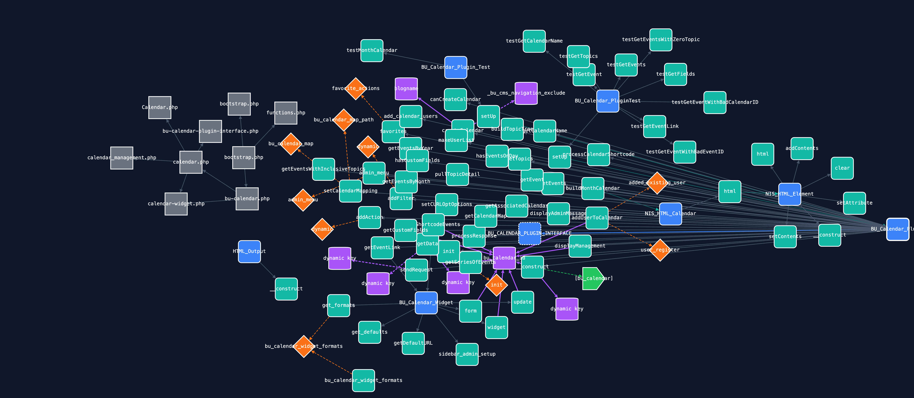

# Plugin Profiler

> **Visualize the architecture of any WordPress plugin as an interactive graph.**

Plugin Profiler is a Dockerized static analysis tool that scans a WordPress plugin directory, parses all PHP, JavaScript, and `block.json` files, and produces an interactive [Cytoscape.js](https://js.cytoscape.org) graph of its architecture — classes, hooks, data sources, REST endpoints, Gutenberg blocks, and more. Optionally, an LLM generates a plain-English description for every node.

---

## Screenshots

> _Analyzing [BU Calendar](https://github.com/bu-ist/bu-calendar-plugin) v1.6.0 (149 nodes, 147 edges). Run takes ~20 seconds with `--no-descriptions`, ~45 seconds with Claude Haiku._

| Graph view — 100 key nodes by connectivity | `BU_Calendar_Plugin` class — connections at a glance |
|---|---|
| [](docs/images/overview.png) | [](docs/images/node-detail.png) |

The **Key nodes** view (default) shows the most-connected nodes plus one hop — so you see the plugin's core without the noise of 149 test utilities and helpers. Click **All nodes** in the toolbar to reveal everything.

---

## What it detects

| Language / File | What's extracted |
|---|---|
| **PHP** | Classes, interfaces, traits, methods, functions |
| **PHP** | `add_action` / `add_filter` hook registrations, `do_action` / `apply_filters` triggers |
| **PHP** | Options API, post meta, user meta, transients, `$wpdb` queries |
| **PHP** | REST routes, AJAX handlers, shortcodes, admin pages, cron jobs, post types, taxonomies, HTTP calls |
| **PHP** | `include` / `require` file relationships |
| **JavaScript / JSX / TS / TSX** | `registerBlockType`, `addAction`, `addFilter`, `apiFetch` calls |
| **block.json** | Gutenberg block definitions, render templates, enqueued scripts |

---

## Requirements

| Requirement | Notes |
|---|---|
| [Docker Desktop](https://www.docker.com/products/docker-desktop/) ≥ 4.x | Or Docker Engine + Compose v2 on Linux |
| Docker Compose v2 | `docker compose version` must work (note: no hyphen) |

No PHP, Node.js, or Composer installation needed on the host machine.

---

## Quick start

```bash
# Clone the repo
git clone https://github.com/bu-ist/plugin-profiler.git
cd plugin-profiler

# Make the CLI script executable (once)
chmod +x bin/plugin-profiler

# Analyze a plugin — skipping LLM descriptions for speed
./bin/plugin-profiler analyze /path/to/your-wp-plugin --no-descriptions
```

The command will:
1. Build the Docker images (first run only — ~2 min)
2. Scan and parse the plugin
3. Write `graph-data.json` to a shared Docker volume
4. Start a local web server on port 9000
5. Open `http://localhost:9000` in your default browser

---

## Installation

### Option A — `bin/plugin-profiler` wrapper (recommended)

The `bin/plugin-profiler` shell script is the primary interface. Symlink it onto your `PATH` for convenience:

```bash
sudo ln -s "$(pwd)/bin/plugin-profiler" /usr/local/bin/plugin-profiler
```

Then from any directory:

```bash
plugin-profiler analyze ~/Sites/woocommerce --no-descriptions
```

### Option B — Docker Compose directly

```bash
PLUGIN_PATH=/absolute/path/to/plugin \
  docker compose run --rm analyzer /plugin --no-descriptions

PLUGIN_PATH=/absolute/path/to/plugin \
  docker compose up -d web
```

Then visit `http://localhost:9000`.

---

## CLI reference

```
Usage: plugin-profiler analyze <plugin-path> [options]

Arguments:
  <plugin-path>        Absolute or relative path to the WordPress plugin directory

Options:
  --port <n>           Port for the web UI  (default: 9000)
  --llm <provider>     LLM provider: claude, ollama, openai, gemini  (default: ollama)
  --model <name>       LLM model identifier  (default: qwen2.5-coder:7b)
  --api-key <key>      API key for external LLM providers
  --no-descriptions    Skip LLM description generation (much faster)
  --json-only          Write graph-data.json only; do not start the web server
  --output <dir>       Output directory inside the container  (default: /output)
  --help               Show help
```

### Examples

```bash
# Basic analysis, no descriptions
plugin-profiler analyze ./my-plugin --no-descriptions

# Use Google Gemini for descriptions
plugin-profiler analyze ./my-plugin \
  --llm gemini \
  --model gemini-2.5-flash \
  --api-key YOUR_GEMINI_KEY

# Use OpenAI GPT-4o mini
plugin-profiler analyze ./my-plugin \
  --llm openai \
  --model gpt-4o-mini \
  --api-key sk-...

# Use Claude (Anthropic)
plugin-profiler analyze ./my-plugin \
  --llm claude \
  --model claude-haiku-4-5-20251001 \
  --api-key sk-ant-...

# Use local Ollama (starts Ollama container automatically)
plugin-profiler analyze ./my-plugin \
  --llm ollama \
  --model qwen2.5-coder:7b

# Output JSON only, then serve manually
plugin-profiler analyze ./my-plugin --no-descriptions --json-only
# graph-data.json is now at /output/graph-data.json inside Docker volume
```

---

## LLM description generation

Plugin Profiler can generate a 2–3 sentence description for every developer-authored node in the graph using an LLM. This is optional — pass `--no-descriptions` to skip it.

Descriptions are only generated for nodes the developer actually wrote. Bundled libraries (detected from directory names like `lib/`, `third-party/`, `bower_components/`, etc.) are automatically skipped.

Nodes with a PHPDoc block automatically get a description from that block even without an LLM. LLM descriptions take precedence when both are present.

### Supported providers

| Provider | `--llm` value | Speed (100 dev nodes) | Cost (100 nodes) |
|---|---|---|---|
| **Ollama (local)** | `ollama` | ~2–5 min | Free |
| **Claude Haiku** | `claude` | ~30–60 sec | ~$0.01 |
| OpenAI GPT-4o mini | `openai` | ~1–2 min | ~$0.04 |
| Google Gemini 2.0 Flash | `gemini` | ~1–2 min | ~$0.01 |

> **Note on analysis time:** Parsing is the main bottleneck for large plugins, not the LLM. A plugin with 1,000+ JS files (e.g. one bundling Ext JS) can take 5–8 minutes to parse before descriptions even begin. Use `--no-descriptions` for quick iteration; only run with an LLM provider when you want the final annotated graph.

### Ollama (local, default)

When `--llm ollama` is used, Plugin Profiler starts an `ollama` Docker container alongside the analyzer. The model is pulled automatically on first use.

```bash
plugin-profiler analyze ./my-plugin --llm ollama --model qwen2.5-coder:7b
```

**First run:** model download is ~4 GB for `qwen2.5-coder:7b`; subsequent runs use the cached `ollama_models` Docker volume.
**Speed:** Ollama runs on CPU by default, so expect ~2–5 min per 100 nodes. Use a smaller model (`qwen2.5-coder:3b`) to halve that.

### External API providers

Claude Haiku is the fastest and cheapest option for most plugins. All external providers use the OpenAI-compatible chat completions API format.

```bash
# Claude (fastest, recommended for large plugins)
plugin-profiler analyze ./my-plugin \
  --llm claude \
  --model claude-haiku-4-5-20251001 \
  --api-key sk-ant-...

# Gemini
plugin-profiler analyze ./my-plugin \
  --llm gemini \
  --model gemini-2.0-flash \
  --api-key AIza...

# OpenAI
plugin-profiler analyze ./my-plugin \
  --llm openai \
  --model gpt-4o-mini \
  --api-key sk-...
```

### Using environment variables

Instead of passing `--llm` and `--api-key` on every run, copy `.env.example` to `.env`:

```dotenv
LLM_PROVIDER=claude
LLM_MODEL=claude-haiku-4-5-20251001
LLM_API_KEY=sk-ant-...
```

Then run without flags:

```bash
plugin-profiler analyze ./my-plugin
```

---

## Using the web UI

Open `http://localhost:9000` (or the port you configured).

### Graph interactions

| Action | Result |
|---|---|
| **Click a node** | Opens the right-hand inspector panel |
| **Hover a node** | Highlights the node and its direct connections; dims everything else |
| **Double-click a node** | Zooms to fit the node and its immediate neighbors |
| **Click canvas** | Deselects and clears highlighting |

### Inspector panel

Clicking a node opens a panel showing:
- Entity type badge + label
- AI-generated description (if available)
- File path + line number (VS Code link: `vscode://file/...`)
- All incoming and outgoing connections, grouped by relationship type — click any to navigate to that node
- Syntax-highlighted source preview (PHP or JS)
- PHPDoc / docblock

### Toolbar

| Control | Purpose |
|---|---|
| **Search box** | Filter nodes by label in real time |
| **Key nodes / All nodes** | Toggle between a focused view (top nodes by connectivity + 1-hop expansion) and the full graph |
| **Structure / Behavior / All** | Filter edges to structural relationships only, behavioral (hooks, data, HTTP), or all |
| **Groups** | Collapse/expand PHP namespace and JS directory compound nodes |
| **⭐ Dev only** | Hide bundled library nodes — see below |
| **Type filter buttons** | Toggle visibility for each node type (`1`–`9` keyboard shortcuts) |
| **Layout dropdown** | Switch between Dagre (hierarchy), fCoSE (force-directed), Breadth-first, Grid |
| **+ / − / Fit** | Zoom controls |

### Dev only — filtering out bundled libraries

Some plugins ship copies of third-party libraries inside the plugin directory (jQuery UI, Ext JS, Underscore, custom builds, etc.). Without filtering, these can add thousands of nodes that have nothing to do with the plugin you're auditing.

**The "Dev only" button hides all library nodes**, leaving only the code the plugin's author actually wrote.

Library detection is automatic — paths containing any of the following segments are tagged as library code:

`lib/`, `libs/`, `vendor/` _(non-Composer)_, `third-party/`, `thirdparty/`, `bower_components/`, `packages/`, `dist/`, `build/`, `bundled/`, `dependencies/`, `external/`

You can also add a `.profilerignore` file to the plugin root to explicitly exclude any path:

```
# .profilerignore
assets/vendor/
legacy/ext-js/
```

> **Tip:** The "Dev only" button only appears in the toolbar when library nodes are actually present in the analysis. For plugins with no bundled code it is hidden automatically.

### Keyboard shortcuts

| Key | Action |
|---|---|
| `/` | Focus the search box |
| `F` | Fit graph to screen |
| `Esc` | Close sidebar, clear highlighting |
| `1` – `9` | Toggle node type filters in order |
| Double-click | Zoom to node neighborhood |

---

## Node types

| Type | Shape | Color | What it represents |
|---|---|---|---|
| `class` | Rounded rectangle | Blue | PHP class |
| `interface` | Rounded rectangle (dashed border) | Blue | PHP interface |
| `trait` | Rounded rectangle (dotted border) | Blue | PHP trait |
| `function` | Rounded rectangle | Teal | Standalone PHP function |
| `method` | Rounded rectangle | Teal | Class method |
| `hook` (action) | Diamond | Orange | `add_action` / `do_action` hook |
| `hook` (filter) | Diamond | Yellow | `add_filter` / `apply_filters` hook |
| `js_hook` | Diamond | Orange | JavaScript `addAction` / `addFilter` |
| `rest_endpoint` | Hexagon | Green | `register_rest_route` |
| `ajax_handler` | Hexagon | Green | `wp_ajax_*` / `wp_ajax_nopriv_*` |
| `shortcode` | Tag | Green | `add_shortcode` |
| `admin_page` | Rectangle | Green | `add_menu_page` / `add_submenu_page` |
| `cron_job` | Ellipse | Green | `wp_schedule_event` |
| `post_type` | Barrel | Green | `register_post_type` |
| `taxonomy` | Barrel | Green | `register_taxonomy` |
| `data_source` | Barrel | Purple | Options, post_meta, user_meta, transients, `$wpdb` |
| `http_call` | Ellipse | Red | `wp_remote_get` / `wp_remote_post` |
| `file` | Rectangle | Gray | PHP file (via `include`/`require`) |
| `gutenberg_block` | Rounded rectangle | Pink | `block.json` / `registerBlockType` |
| `js_api_call` | Ellipse | Green | `apiFetch` REST call |
| `namespace` | Rounded rectangle | Slate (group) | PHP namespace compound group |
| `dir` | Rounded rectangle | Dark slate (group) | JS directory compound group |

---

## Edge types

| Type | Style | Meaning |
|---|---|---|
| `extends` | Solid blue | Class inheritance |
| `implements` | Solid blue | Interface implementation |
| `has_method` | Default | Class → method |
| `registers_hook` | Dashed orange | Function/method registers a hook |
| `triggers_hook` | Dashed orange | Function/method triggers a hook |
| `reads_data` | Thick purple | Reads from a data source |
| `writes_data` | Thick dashed purple | Writes to a data source |
| `http_request` | Red | Outbound HTTP call |
| `includes` | Default | File include/require |
| `renders_block` | Dotted pink | Gutenberg block → PHP render template |
| `enqueues_script` | Dotted pink | Gutenberg block → JS asset |
| `uses_trait` | Dashed blue | Class uses a PHP trait |
| `instantiates` | Dotted teal | Function/method creates a `new ClassName()` |
| `calls_endpoint` | Solid pink | JS `apiFetch` / `fetch` → PHP REST endpoint |
| `calls_ajax_handler` | Dashed pink | JS `fetch` to `admin-ajax.php` → PHP AJAX handler |
| `js_block_matches_php` | Dotted pink | JS block registration → PHP block definition |

---

## Configuration

Copy `.env.example` to `.env` and edit as needed:

```bash
cp .env.example .env
```

```dotenv
# Web UI port
PORT=9000

# Absolute path to the plugin directory on your host
PLUGIN_PATH=./my-plugin

# LLM provider: claude | ollama | openai | gemini
LLM_PROVIDER=ollama
LLM_MODEL=qwen2.5-coder:7b

# Required for external providers
LLM_API_KEY=

# Ollama host (leave as-is when using the bundled container)
OLLAMA_HOST=http://ollama:11434

# Tuning
LLM_BATCH_SIZE=25
LLM_TIMEOUT=120
```

---

## Architecture

```
┌─────────────────────────────────────────────────────┐
│                  Docker Compose                     │
│                                                     │
│  ┌──────────────┐   graph-data.json  ┌───────────┐  │
│  │   analyzer   │ ─────────────────► │    web    │  │
│  │ php:8.1-cli  │   shared volume    │   nginx   │  │
│  └──────────────┘                   └───────────┘  │
│         │                                  │        │
│  ┌──────┴──────┐              http://localhost:9000 │
│  │   ollama    │ (optional, --llm ollama profile)   │
│  └─────────────┘                                   │
└─────────────────────────────────────────────────────┘

Host machine
  └── /path/to/plugin  →  bind-mounted read-only as /plugin
```

### Analyzer pipeline

1. **FileScanner** — Discovers `.php`, `.js`, `.jsx`, `.ts`, `.tsx`, `block.json` files. Skips `vendor/`, `node_modules/`, `.git/`.
2. **PluginParser** — Runs the AST visitors on each file type.
3. **Visitors** (PHP via nikic/php-parser v5, JS via mck89/peast):
   - `ClassVisitor` — classes, interfaces, traits, inheritance, trait-usage edges
   - `FunctionVisitor` — functions, methods, class-instantiation edges
   - `HookVisitor` — `add_action`, `add_filter`, `do_action`, `apply_filters`
   - `DataSourceVisitor` — Options API, post/user meta, transients, `$wpdb`
   - `ExternalInterfaceVisitor` — REST, AJAX, shortcodes, admin pages, cron, post types, taxonomies, HTTP
   - `FileVisitor` — `include` / `require` relationships
   - `JavaScriptVisitor` — `registerBlockType`, `addAction`, `addFilter`, `apiFetch`
   - `BlockJsonVisitor` — `block.json` blocks
4. **CrossReferenceResolver** — Connects JS calls to their PHP handlers: `apiFetch` → REST endpoint, `admin-ajax.php` fetches → AJAX handler, Gutenberg block JS ↔ PHP definition.
5. **GraphBuilder** — Resolves cross-references, drops edges to missing nodes.
6. **DescriptionGenerator** (optional) — Batches entities to LLM, attaches descriptions.
7. **JsonExporter** — Writes Cytoscape.js-compatible `graph-data.json`.

### Frontend

Vanilla JavaScript — no build step. Loaded via CDN:
- [Cytoscape.js](https://js.cytoscape.org) + [cytoscape-dagre](https://github.com/cytoscape/cytoscape.js-dagre) + [cytoscape-fcose](https://github.com/iVis-at-Bilkent/cytoscape.js-fcose)
- [Tailwind CSS](https://tailwindcss.com)
- [Prism.js](https://prismjs.com) (syntax highlighting)

---

## Development

### Running tests

All tests require Docker (local PHP is likely not 8.1):

```bash
# Build the test image and run all 211 tests
docker build --target test -t plugin-profiler-test ./analyzer
docker run --rm plugin-profiler-test
```

Or using the CLAUDE.md test command shorthand:

```bash
docker build --target test -t plugin-profiler-test ./analyzer && docker run --rm plugin-profiler-test
```

### Lint (PHP code style — PSR-12)

```bash
cd analyzer && ./vendor/bin/php-cs-fixer fix --dry-run --diff
# Auto-fix:
cd analyzer && ./vendor/bin/php-cs-fixer fix
```

### Frontend development

The web frontend uses no build step. To develop locally with live reload:

```bash
cd web && npm install && npm run dev
# Serves on http://localhost:9000
# Note: /data/graph-data.json must exist — run the analyzer first
```

### Project structure

```
plugin-profiler/
├── bin/
│   └── plugin-profiler         # Main CLI entry point (bash)
├── analyzer/
│   ├── bin/analyze              # PHP CLI entry (called inside Docker)
│   ├── src/
│   │   ├── Command/             # Symfony Console command
│   │   ├── Scanner/             # File discovery
│   │   ├── Parser/
│   │   │   └── Visitors/        # AST visitors (PHP + JS + block.json)
│   │   ├── Graph/               # Node, Edge, EntityCollection, GraphBuilder
│   │   ├── LLM/                 # OllamaClient, ApiClient, DescriptionGenerator
│   │   └── Export/              # JsonExporter
│   └── tests/
│       ├── Unit/                # Per-class unit tests
│       ├── Integration/         # Full pipeline test
│       └── fixtures/            # Sample plugin for testing
├── web/
│   ├── index.html
│   ├── js/
│   │   ├── app.js               # Entry: fetch data, init graph
│   │   ├── constants.js         # Node/edge type metadata (colors, shapes, badges)
│   │   ├── graph.js             # Cytoscape config + node/edge styles
│   │   ├── sidebar.js           # Inspector panel
│   │   ├── search.js            # Search + type filter toggles
│   │   └── layouts.js           # Layout algorithm configs
│   └── nginx.conf
├── docker-compose.yml
├── .env.example
└── agent_docs/                  # Internal architecture specs
```

---

## Output format

The analyzer writes `graph-data.json` to the shared Docker volume, served at `/data/graph-data.json`. The format is Cytoscape.js-compatible:

```json
{
  "plugin": {
    "name": "My Plugin",
    "version": "1.2.3",
    "description": "...",
    "main_file": "my-plugin.php",
    "total_files": 42,
    "total_entities": 138,
    "analyzed_at": "2026-02-20T14:30:00+00:00",
    "analyzer_version": "0.1.0"
  },
  "nodes": [
    {
      "data": {
        "id": "class_MyPlugin_Controller",
        "label": "Controller",
        "type": "class",
        "subtype": null,
        "file": "/plugin/src/Controller.php",
        "line": 12,
        "metadata": { "namespace": "MyPlugin", "extends": null, ... },
        "docblock": "Handles all form submissions.",
        "description": "AI-generated description here.",
        "source_preview": "class Controller {\n  ..."
      }
    }
  ],
  "edges": [
    {
      "data": {
        "id": "e_0",
        "source": "class_MyPlugin_Controller",
        "target": "hook_action_init",
        "type": "registers_hook",
        "label": "registers"
      }
    }
  ]
}
```

---

## Troubleshooting

### "Docker is not installed or not in PATH"

Install [Docker Desktop](https://www.docker.com/products/docker-desktop/) and ensure it's running.

### "docker compose version" fails

You need Docker Compose v2. With Docker Desktop this is included. On Linux:
```bash
sudo apt install docker-compose-plugin  # Debian/Ubuntu
```

### Analysis produces 0 nodes

- Verify the plugin path is correct and contains `.php` files
- Ensure the path is readable and not inside a network drive

### Ollama model download is slow

The first run with `--llm ollama` downloads the model (~4 GB for qwen2.5-coder:7b). Subsequent runs reuse the cached `ollama_models` Docker volume. Use a smaller model to speed this up:
```bash
plugin-profiler analyze ./plugin --llm ollama --model qwen2.5-coder:3b
```

### "Failed to load graph data" in browser

Run the analyzer before opening the browser:
```bash
plugin-profiler analyze ./my-plugin --no-descriptions
```

### Port 9000 already in use

```bash
plugin-profiler analyze ./my-plugin --no-descriptions --port 8080
```

### Rebuilding images after a code update

```bash
docker compose build
```

---

## CI

This repository ships a GitHub Actions workflow (`.github/workflows/ci.yml`) with three jobs:

| Job | What it checks |
|---|---|
| **PHP Tests** | Runs all 211 PHPUnit tests on PHP 8.1; checks PSR-12 style with php-cs-fixer |
| **Docker Build** | Confirms both `analyzer` and `web` images build cleanly |
| **JS Lint** | Runs ESLint on `web/js/` |

---

## License

MIT — see [LICENSE](LICENSE).

---

## Contributing

1. Fork and clone
2. Make changes in a feature branch
3. Run the test suite: `docker build --target test -t plugin-profiler-test ./analyzer && docker run --rm plugin-profiler-test`
4. Check code style: `cd analyzer && ./vendor/bin/php-cs-fixer fix --dry-run`
5. Open a pull request against `main`
